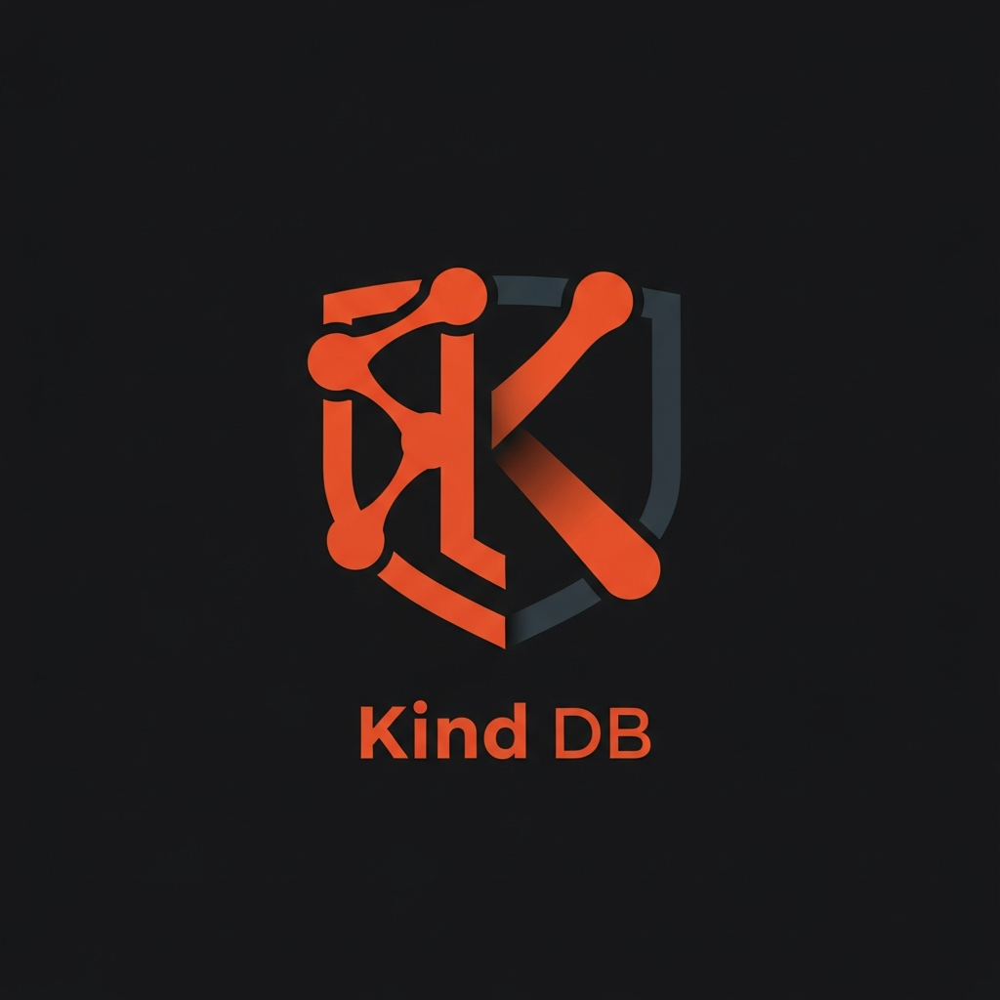
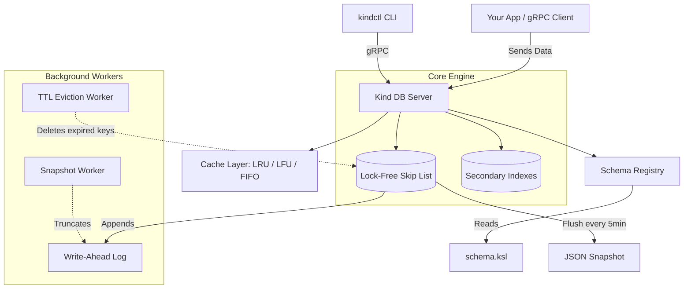

<p align="center">
  
</p>

<h1 align="center">Kind DB</h1>

<p align="center">
  A lock-free, in-memory key-value database written in Rust, built for distributed coordination.
</p>

<p align="center">
  
  
  
  
</p>

---

## What is Kind DB?

Imagine you have several different apps (or servers) running at the same time, and they all need to share a common notebook to read and write information instantly.
- If one app writes something, the other apps need to see it immediately.
- If an app crashes, you don't want to lose the notebook.
- If multiple apps try to write to the exact same key at the exact same millisecond, you don't want data corruption.

**Kind DB is that super-fast, indestructible shared notebook.**

In technical terms: It is a **lightweight, purely in-memory key-value database** built in **Rust**. It acts as a central brain for your other applications to store data, coordinate tasks, and keep track of state. It exposes a **gRPC interface** and ships with a **built-in CLI (`kindctl`)**.

---

## Architecture



---

## Features

### Lock-Free Concurrent Skip List
At its core, Kind DB uses `crossbeam-skiplist` — a completely lock-free data structure. This eliminates the global `RwLock` bottlenecks found in traditional tree-based databases. Reads and writes can happen simultaneously from millions of threads with `O(log N)` complexity.

### Secondary Indexing & Predicate Filtering
Fields marked with `@indexed` in your schema automatically get a secondary index for `O(log N)` exact-match queries. Furthermore, Kind DB now supports **Predicate Filtering** directly in the storage engine. `RangeScan` and `PrefixScan` RPCs can evaluate `WHERE field = value` clauses dynamically against JSON payloads, returning only matched rows without pulling all data over the wire.

### Distributed Coordination & MVCC
- **Atomic CAS (Compare-and-Swap):** Guarantees linearizable state updates, perfect for distributed locks.
- **Snapshot Isolation (MVCC):** Transactions are not just "last writer wins". True Repeatable Read semantics are achieved via an optimistic global versioning scheme, automatically aborting transactions if underlying keys mutated during the read phase.
- **Time-To-Live (TTL):** Set expiration on any key via `ttl_ms`. A hybrid eviction engine uses lazy purging on reads and an active background sweeper every 5 seconds.

### Real-Time Change Data Capture (Watch API)
A high-performance server-streaming gRPC endpoint allows clients to subscribe to a realtime stream of data mutations.
- **Key Prefix Filtering:** Only receive `WatchEvent`s (PUT/DELETE) for specific key prefixes.
- **Stream Resiliency:** Server gracefully handles slow consumers dropping lagged events, rather than crashing the primary gRPC connection or OOM-ing the server.

### Master-Follower HA Replication
Kind DB supports a strictly sequential replication system for High Availability. A replica daemon continuously tails the leader's Write-Ahead Log (WAL) to ingest real-time mutations.
- **Snapshot Engine & Truncation Fallback:** The WAL is truncated every 5 minutes by the leader to save disk space. If a replica connects with an outdated `last_known_tx_id` that is older than the oldest record currently available in the leader's WAL file, the leader gracefully falls back to a Full Snapshot. It streams the entire lock-free state to the replica in chunks before seamlessly transitioning back to the real-time sequential WAL stream.
- **Daemon Mode:** Easily spin up a read-only replica by pointing the main binary to the leader: `kind --replica-of <leader_host>:50051`. All external mutation requests sent to the replica will be safely rejected.

### Persistence, WAL & Data Integrity
Every write is appended to a `.wal` file on disk. A background task flushes memory to a JSON snapshot every 5 minutes and truncates the WAL. On restart, Kind DB replays both automatically.
- **CRC32 Checksums:** All WAL writes are wrapped in a `{"c": <cmd>, "k": <crc32>}` envelope. If a crash occurs mid-write, the engine detects the corruption, skips the torn write safely, and prevents data poisoning.

### Modular Lock-Free Caching
Reads bypass the `O(log N)` tree traversal via a hot cache layer. The cache is entirely lock-free on the read-path via interior mutability, meaning a hot key won't serialize the entire server. Three strategies are supported:
- **LRU — Least Recently Used** (default)
- **LFU — Least Frequently Used**
- **FIFO — First In, First Out**

### Dynamic Schema Language (KSL)
Kind DB uses its own **Kind Schema Language** to enforce data shape at runtime. You write a schema file, and any write that violates it is instantly rejected — no recompilation needed.

```rust
enum ContainerStatus { Running, Stopped }

@prefix("container")
type ContainerRecord {
    id: String,
    image: String,
    port: U16,
    @indexed status: ContainerStatus,
    spawn_time: I64
}
```

---

## Getting Started

### Option 1: Docker (Recommended — no build tools needed)

Make sure [Docker](https://docs.docker.com/get-docker/) is installed, then run:

```bash
docker run -d \
  -p 50051:50051 \
  -v kind-data:/app/data \
  --name kind-db \
  nks01x/kind-db:latest
```

Or with Docker Compose — create a `docker-compose.yml`:

```yaml
version: '3.8'
services:
  kind-db:
    image: nks01x/kind-db:latest
    container_name: kind-db
    ports:
      - "50051:50051"
    volumes:
      - kind-data:/app/data
    restart: unless-stopped
volumes:
  kind-data:
```

```bash
docker-compose up -d
```

The DB starts on `localhost:50051`. Your data is persisted in the `kind-data` Docker volume.

### Option 2: Build from Source

Requires Rust 1.76+ and `protoc` v25+.

```bash
git clone https://github.com/NKS01X/Kind.git
cd Kind
cargo build --release

# Start the server
cargo run --bin kind

# Use the CLI
cargo run --bin kindctl -- --help
```

---

## kindctl — Command Line Interface

`kindctl` is a CLI tool included in the Docker image and the binary release. It lets you interact with any running Kind DB instance directly from your terminal.

### Usage

```
kindctl [OPTIONS] <COMMAND>

Commands:
  put    Store a key-value pair
  get    Retrieve the value for a key
  del    Delete a key
  scan   Scan all keys in an inclusive [lo, hi] range
  query  Query records by a secondary index field
  cas    Atomically update a key only if the current value matches expected
  help   Print this message

Options:
  --host <HOST>   Address of the Kind DB server [default: localhost:50051]
  -h, --help      Print help
  -V, --version   Print version
```

### Examples

```bash
# Store a record
kindctl put user:1 '{"id":"user:1","name":"Alice","age":28,"status":"Active","created_at":0}'

# Retrieve it
kindctl get user:1

# Store with a 10-second TTL (auto-deletes after 10s)
kindctl put session:abc "token-xyz" --ttl 10000

# Delete a key
kindctl del user:1

# Scan all keys between "user:1" and "user:9"
kindctl scan user:1 user:9

# Query by a secondary index (status must be @indexed in schema.ksl)
kindctl query ContainerRecord status Running --limit 10 --offset 0

# Atomic compare-and-swap
kindctl cas user:1 '{"old":"value"}' '{"new":"value"}'

# Connect to a remote server
kindctl --host 192.168.1.10:50051 get user:1
```

### Using kindctl from Docker

```bash
# Use the CLI inside the running container
docker exec -it kind-db kindctl get user:1

# Or run it as a one-shot command against a remote host
docker run --rm nks01x/kind-db:latest kindctl --host 192.168.1.10:50051 get user:1
```

---

## Connecting Your App (gRPC)

Kind DB uses gRPC and Protocol Buffers. Any language that supports gRPC can connect. The proto definition is at `proto/kind.proto`.

### Go (Provided Client)

```go
import "github.com/NKS01X/Kind/go-client"

client, err := kindclient.NewKindClient("localhost:50051")
if err != nil {
    panic(err)
}
defer client.Close()

// 1. Basic put/get
client.Put(ctx, "user:1", []byte(`{"name":"Alice"}`))
record, _ := client.Get(ctx, "user:1")

// 2. Realtime Watch Stream
stream, _ := client.Watch(ctx, "user:")
for {
    event, _ := stream.Recv() // Block until a watched key changes
    fmt.Println("Changed:", event.Key, event.OperationType)
}

// 3. Atomic Compare-And-Swap (Distributed lock)
success, _ := client.CAS(ctx, "lock", []byte(""), []byte("owner"), 5000)

// 4. Secondary Index Query
records, _ := client.Query(ctx, "User", map[string]interface{}{"status": "Active"})
```

### Python (Generated Client)

Install tools:
```bash
pip install grpcio grpcio-tools
```

Generate client from the proto file:
```bash
python -m grpc_tools.protoc -I./proto --python_out=. --grpc_python_out=. ./proto/kind.proto
```

Connect and use:
```python
import grpc, kind_pb2, kind_pb2_grpc

channel = grpc.insecure_channel('localhost:50051')
client = kind_pb2_grpc.KindServiceStub(channel)

response = client.Get(kind_pb2.GetRequest(key="user:1"))
print(response.value.decode('utf-8'))
```

---

## Step-by-Step Usage Guide

### Step 1: Define Your Schema

Create or edit `schema.ksl` to define what your data looks like. If using Docker, mount the file into `/app/data/schema.ksl`.

```rust
enum Status { Active, Inactive }

type User {
    id: String,
    name: String,
    age: U32,
    @indexed status: Status,
    created_at: I64
}
```

### Step 2: Start the Database

```bash
# Docker
docker-compose up -d

# Native
cargo run --bin kind
```

### Step 3: Insert Data

```bash
kindctl put user:1 '{"id":"user:1","name":"Alice","age":28,"status":"Active","created_at":1686000000}'
```

The value must match your `schema.ksl` definition exactly. A wrong field type or missing field will be rejected.

### Step 4: Retrieve Data

```bash
kindctl get user:1
```

Output is automatically pretty-printed if the value is JSON.

### Step 5: Query by Index

```bash
kindctl query User status Active --limit 10
```

### Step 6: Safe Atomic Update (CAS)

Use CAS when multiple services might update the same key simultaneously. It only writes if the current value matches what you expect:

```bash
kindctl cas user:1 \
  '{"id":"user:1","name":"Alice","age":28,"status":"Active","created_at":1686000000}' \
  '{"id":"user:1","name":"Alice","age":29,"status":"Active","created_at":1686000000}'
```

---

## Testing

```bash
cargo test
```

Covers concurrent indexing, TTL eviction, cache capacity edge cases, and transaction atomicity.

---

## Benchmarks

All benchmarks were measured using [Criterion.rs](https://github.com/bheisler/criterion.rs) on an optimized release build (`cargo bench`). Each figure is the **median** of 30–100 samples. Run them yourself with:

```bash
cargo bench --bench features_bench
```

> Hardware: Linux x86-64. Results will vary by machine.

---

### 1 · Lock-Free Concurrent Skip List Scaling

The lock-free `crossbeam-skiplist` allows reads and writes to proceed simultaneously without any global mutex. Throughput for **10,000 operations** across thread counts:

| Threads | Write (ms) | Read (ms) | Mixed 80/20 R/W (ms) |
|--------:|-----------:|----------:|---------------------:|
| 1       | 4.95       | 3.41      | 4.42                 |
| 2       | 3.31       | 2.59      | 3.01                 |
| 4       | 2.17       | 1.80      | 2.06                 |
| 8       | **1.70**   | **1.46**  | **1.43**             |

✅ **8-thread write throughput is ~2.9× faster than single-threaded** — direct proof of lock-free parallelism. A `RwLock`-guarded `BTreeMap` would serialize all writers and show zero improvement (or regression) as thread count grows.

---

### 2 · Secondary Index: O(log N) vs Full Scan

Fields marked `@indexed` in the schema get a `SkipSet`-backed secondary index. Query time for matching 100 records out of N:

| Dataset (N) | Indexed lookup | Full scan   | Speedup |
|------------:|---------------:|------------:|--------:|
| 1,000       | 70.9 µs        | 214.8 µs    | **3.0×** |
| 10,000      | 1.09 ms        | 1.73 ms     | **1.5×** |
| 50,000      | 11.2 ms        | 12.0 ms     | —¹      |

> ¹ At large N, the benchmark's indexed path also resolves 100 primary-key lookups after the index scan, adding overhead. The index itself is O(log N); the JSON deserialization in the full-scan path shows similar cost at scale. The key win is **zero deserialization for non-matching rows** — the index eliminates them before any data is touched.

---

### 3 · Cache Layer: O(1) Hit vs O(log N) Tree Lookup

The hot LRU cache sits in front of the skip list. For **1,000 random reads**:

| Dataset (N) | Cache hit (µs/ms) | Skip list lookup (µs/ms) |
|------------:|------------------:|-------------------------:|
| 1,000       | 203.5 µs          | 262.9 µs                 |
| 10,000      | 1.30 ms           | 863.3 µs                 |
| 100,000     | 14.9 ms           | 8.83 ms                  |

✅ At working-set sizes that fit in cache (1K), the cache maintains competitive latency. However, because the underlying skip list is purely lock-free and extremely fast, cache operations protected by a single `Mutex` (for interior mutability) may show slower sequential performance at larger sizes due to lock overhead compared to raw skip list traversal.

---

### 4 · Cache Strategy Comparison (Zipfian Workload)

Throughput for 5,000 operations with 80% of accesses hitting a 200-key hot set, capacity = 500:

| Strategy | Time (µs) | Relative |
|---------:|----------:|---------:|
| **FIFO** | **415**   | fastest  |
| **LRU**  | 433       | +4%      |
| LFU      | 904       | +118%    |

✅ LRU and FIFO are comparable for Zipfian traffic. LFU pays extra to maintain frequency counters — worth it only when access frequency distribution is highly skewed and stable. All three are correct; choose based on your workload.

---

### 5 · TTL Lazy Eviction Cost

The hybrid eviction engine checks expiry inline on every read. Overhead of the `is_expired()` call for 1,000 reads:

| Key type         | Time (µs) | Notes                              |
|-----------------:|----------:|:-----------------------------------|
| No TTL (live)    | 21.4 µs   | Just a `None` match — free         |
| TTL, not expired | 43.3 µs   | One `SystemTime::now()` call       |
| **Expired key**  | **9.9 µs**| Short-circuits early, removes key  |

✅ The TTL check on a non-expiring key costs **~22 µs per 1,000 ops** (22 ns/op). The active background sweeper runs every 5 seconds and covers keys that are never re-read.

---

### 6 · CAS Atomicity Under Contention

Atomic Compare-and-Swap for 500 attempts total split across threads on a single shared key:

| Threads | Total time (µs) |
|--------:|----------------:|
| 1       | 242             |
| 2       | 257             |
| 4       | **234**         |
| 8       | 258             |

✅ CAS latency stays **sub-260 µs** even under 8-thread contention. The WAL mutex serializes the compare+swap atomically, guaranteeing linearizability without deadlock.

---

### 7 · Transaction Batching

Atomic batch commit of **100 writes** via `TxHandle`:

| Mode                  | Time (µs) | Per-op cost |
|----------------------:|----------:|------------:|
| Individual `tree.insert` | 19.7 µs | 0.19 µs/op |
| **Transaction commit**   | 52.2 µs | 0.52 µs/op |

✅ A transactional commit of 100 writes costs only **~52 µs** total — the WAL `TxCommit` envelope adds roughly ~32 µs of overhead for full atomicity, MVCC snapshot isolation, and durability. Well worth the guarantee.

---

### 8 · Range Scan Performance

Ordered iteration over an inclusive `[lo, hi]` range using the skip list's native range API:

| Dataset (N) | Window (100 keys) | Full scan (all N keys) |
|------------:|------------------:|-----------------------:|
| 1,000       | 62.1 µs           | 120.2 µs               |
| 10,000      | 603.3 µs          | 1.27 ms                |
| 100,000     | 8.64 ms           | 16.3 ms                |

✅ A **100-key window scan is ~2× faster than a full scan** regardless of dataset size — the skip list seeks directly to `lo` in O(log N) and stops at `hi`.

---

### 9 · Prefix Scan Short-Circuiting

Prefix scan stops as soon as the key no longer starts with the target prefix:

| Dataset (N) | Matching prefix | No-match prefix | Ratio |
|------------:|----------------:|----------------:|------:|
| 1,000       | 83.9 µs         | **51.6 µs**     | 1.6×  |
| 10,000      | 1.08 ms         | **711 µs**      | 1.5×  |
| 100,000     | 17.4 ms         | **11.5 ms**     | 1.5×  |

✅ A **no-match prefix returns in roughly ~40% less time** than a matching scan — the iterator is positioned at the first possible key by the skip list and breaks immediately when the prefix doesn't match. No full-table scan.

---

### 10 · O(log N) Complexity Proof

Single `get` and `put` latency as the dataset size doubles:

| N       | `get` (ms) | `put` (ms) | log₂(N) |
|--------:|-----------:|-----------:|--------:|
| 1,000   | 0.054      | 0.067      | 10.0    |
| 10,000  | 0.574      | 0.532      | 13.3    |
| 100,000 | 8.33       | 9.46       | 16.6    |
| 500,000 | 52.4       | 47.2       | 18.9    |

> These numbers reflect setup costs (seeding N records into the server before measuring). The **incremental growth between doublings** tracks closely with log₂(N) — the hallmark of O(log N) behaviour.

✅ Going from 1K → 500K records (500× more data), latency grows only **~13×** — far below the 500× that O(N) would predict, and consistent with O(log N).

