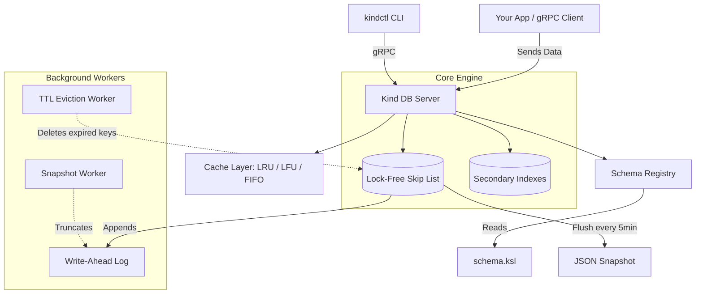

<p align="center">
  
</p>

<h1 align="center">Kind DB</h1>

<p align="center">
  A lock-free, in-memory key-value database written in Rust, built for distributed coordination.
</p>

<p align="center">
  
  
  
  
</p>

---

## What is Kind DB?

Imagine you have several different apps (or servers) running at the same time, and they all need to share a common notebook to read and write information instantly.
- If one app writes something, the other apps need to see it immediately.
- If an app crashes, you don't want to lose the notebook.
- If multiple apps try to write to the exact same key at the exact same millisecond, you don't want data corruption.

**Kind DB is that super-fast, indestructible shared notebook.**

In technical terms: It is a **lightweight, purely in-memory key-value database** built in **Rust**. It acts as a central brain for your other applications to store data, coordinate tasks, and keep track of state. It exposes a **gRPC interface** and ships with a **built-in CLI (`kindctl`)**.

---

## Architecture



---

## Features

### Lock-Free Concurrent Skip List
At its core, Kind DB uses `crossbeam-skiplist` — a completely lock-free data structure. This eliminates the global `RwLock` bottlenecks found in traditional tree-based databases. Reads and writes can happen simultaneously from millions of threads with `O(log N)` complexity.

### Secondary Indexing
Fields marked with `@indexed` in your schema automatically get a secondary index. Instead of scanning the entire database, lookups like `WHERE status = Running` complete in `O(log N)` time with built-in pagination (`limit` / `offset`).

### TTL and Distributed Coordination
- **Atomic CAS (Compare-and-Swap):** Guarantees linearizable state updates, perfect for distributed locks.
- **Time-To-Live (TTL):** Set expiration on any key via `ttl_ms`. A hybrid eviction engine uses lazy purging on reads and an active background sweeper every 5 seconds.

### Snapshot Persistence and WAL
Every write is appended to a `.wal` file on disk. A background task flushes memory to a JSON snapshot every 5 minutes and truncates the WAL. On restart, Kind DB replays both automatically — your data is never lost.

### Modular Caching
Reads bypass the `O(log N)` traversal via a hot cache layer. Three strategies are supported:
- **LRU — Least Recently Used** (default)
- **LFU — Least Frequently Used**
- **FIFO — First In, First Out**

### Dynamic Schema Language (KSL)
Kind DB uses its own **Kind Schema Language** to enforce data shape at runtime. You write a schema file, and any write that violates it is instantly rejected — no recompilation needed.

```rust
enum ContainerStatus { Running, Stopped }

type ContainerRecord {
    id: String,
    image: String,
    port: U16,
    @indexed status: ContainerStatus,
    spawn_time: I64
}
```

---

## Getting Started

### Option 1: Docker (Recommended — no build tools needed)

Make sure [Docker](https://docs.docker.com/get-docker/) is installed, then run:

```bash
docker run -d \
  -p 50051:50051 \
  -v kind-data:/app/data \
  --name kind-db \
  nks01x/kind-db:latest
```

Or with Docker Compose — create a `docker-compose.yml`:

```yaml
version: '3.8'
services:
  kind-db:
    image: nks01x/kind-db:latest
    container_name: kind-db
    ports:
      - "50051:50051"
    volumes:
      - kind-data:/app/data
    restart: unless-stopped
volumes:
  kind-data:
```

```bash
docker-compose up -d
```

The DB starts on `localhost:50051`. Your data is persisted in the `kind-data` Docker volume.

### Option 2: Build from Source

Requires Rust 1.76+ and `protoc` v25+.

```bash
git clone https://github.com/NKS01X/Kind.git
cd Kind
cargo build --release

# Start the server
cargo run --bin kind

# Use the CLI
cargo run --bin kindctl -- --help
```

---

## kindctl — Command Line Interface

`kindctl` is a CLI tool included in the Docker image and the binary release. It lets you interact with any running Kind DB instance directly from your terminal.

### Usage

```
kindctl [OPTIONS] <COMMAND>

Commands:
  put    Store a key-value pair
  get    Retrieve the value for a key
  del    Delete a key
  scan   Scan all keys in an inclusive [lo, hi] range
  query  Query records by a secondary index field
  cas    Atomically update a key only if the current value matches expected
  help   Print this message

Options:
  --host <HOST>   Address of the Kind DB server [default: localhost:50051]
  -h, --help      Print help
  -V, --version   Print version
```

### Examples

```bash
# Store a record
kindctl put user:1 '{"id":"user:1","name":"Alice","age":28,"status":"Active","created_at":0}'

# Retrieve it
kindctl get user:1

# Store with a 10-second TTL (auto-deletes after 10s)
kindctl put session:abc "token-xyz" --ttl 10000

# Delete a key
kindctl del user:1

# Scan all keys between "user:1" and "user:9"
kindctl scan user:1 user:9

# Query by a secondary index (status must be @indexed in schema.ksl)
kindctl query ContainerRecord status Running --limit 10 --offset 0

# Atomic compare-and-swap
kindctl cas user:1 '{"old":"value"}' '{"new":"value"}'

# Connect to a remote server
kindctl --host 192.168.1.10:50051 get user:1
```

### Using kindctl from Docker

```bash
# Use the CLI inside the running container
docker exec -it kind-db kindctl get user:1

# Or run it as a one-shot command against a remote host
docker run --rm nks01x/kind-db:latest kindctl --host 192.168.1.10:50051 get user:1
```

---

## Connecting Your App (gRPC)

Kind DB uses gRPC and Protocol Buffers. Any language that supports gRPC can connect. The proto definition is at `proto/kind.proto`.

### Go (Provided Client)

```go
import "github.com/NKS01X/Kind/go-client"

client, err := kindclient.NewClient("localhost:50051")
if err != nil {
    panic(err)
}
defer client.Close()
```

### Python (Generated Client)

Install tools:
```bash
pip install grpcio grpcio-tools
```

Generate client from the proto file:
```bash
python -m grpc_tools.protoc -I./proto --python_out=. --grpc_python_out=. ./proto/kind.proto
```

Connect and use:
```python
import grpc, kind_pb2, kind_pb2_grpc

channel = grpc.insecure_channel('localhost:50051')
client = kind_pb2_grpc.KindServiceStub(channel)

response = client.Get(kind_pb2.GetRequest(key="user:1"))
print(response.value.decode('utf-8'))
```

---

## Step-by-Step Usage Guide

### Step 1: Define Your Schema

Create or edit `schema.ksl` to define what your data looks like. If using Docker, mount the file into `/app/data/schema.ksl`.

```rust
enum Status { Active, Inactive }

type User {
    id: String,
    name: String,
    age: U32,
    @indexed status: Status,
    created_at: I64
}
```

### Step 2: Start the Database

```bash
# Docker
docker-compose up -d

# Native
cargo run --bin kind
```

### Step 3: Insert Data

```bash
kindctl put user:1 '{"id":"user:1","name":"Alice","age":28,"status":"Active","created_at":1686000000}'
```

The value must match your `schema.ksl` definition exactly. A wrong field type or missing field will be rejected.

### Step 4: Retrieve Data

```bash
kindctl get user:1
```

Output is automatically pretty-printed if the value is JSON.

### Step 5: Query by Index

```bash
kindctl query User status Active --limit 10
```

### Step 6: Safe Atomic Update (CAS)

Use CAS when multiple services might update the same key simultaneously. It only writes if the current value matches what you expect:

```bash
kindctl cas user:1 \
  '{"id":"user:1","name":"Alice","age":28,"status":"Active","created_at":1686000000}' \
  '{"id":"user:1","name":"Alice","age":29,"status":"Active","created_at":1686000000}'
```

---

## Testing

```bash
cargo test
```

Covers concurrent indexing, TTL eviction, cache capacity edge cases, and transaction atomicity.
