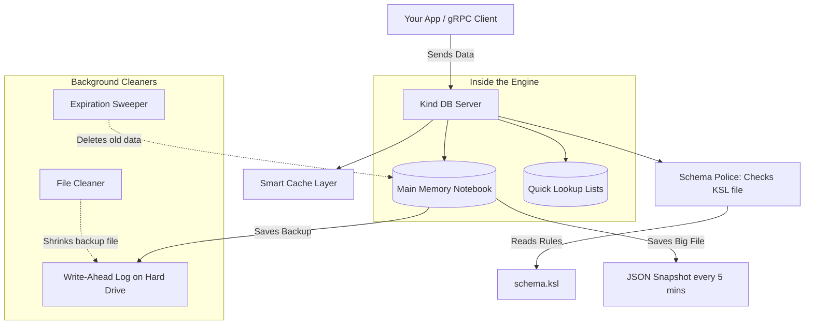

# 🌟 Kind DB

Welcome to **Kind DB**! 

If you are new here and wondering, *"What on earth is this, and why should I care?"* — you are in the right place. This guide is written so that absolutely anyone can understand what Kind DB is, how it works, and how to use it.

---

## 📖 What is Kind DB?

Imagine you have several different apps (or servers) running at the same time, and they all need to share a common notebook to read and write information instantly. 
- If one app writes, "User Alice just logged in," the other apps need to see it immediately. 
- If an app crashes, you don't want to lose the notebook. 
- If multiple apps try to write to the exact same page at the exact same millisecond, you don't want the notebook to get corrupted.

**Kind DB is that super-fast, indestructible shared notebook.** 

In technical terms: It is a **lightweight, purely in-memory key-value database**. It is built in **Rust** (which makes it incredibly fast and safe) and acts as a central brain for your other applications to store data, coordinate tasks, and keep track of state.

### Why is it special?
1. **Blazing Fast (In-Memory)**: Instead of saving data directly to a slow hard drive, Kind DB keeps all your data in RAM (your computer's active memory). This makes reading and writing almost instantaneous.
2. **Never Loses Data (WAL & Snapshots)**: Even though it lives in memory, it writes a backup log (Write-Ahead Log) to your hard drive every time you make a change. If your server suddenly loses power, Kind DB simply reads this backup file when it turns back on, putting everything exactly back the way it was.
3. **No Traffic Jams (Lock-Free)**: Traditional databases sometimes freeze when too many users try to write at once (like a traffic jam). Kind DB uses advanced "lock-free" math (a Concurrent Skip List) so millions of requests can happen simultaneously without slowing down.
4. **Strict Rules (KSL Schema)**: You define exactly what your data should look like in a file. If an app tries to save bad data (like saving text instead of a number), Kind DB rejects it immediately.

---

## 🏗️ How it Works (Architecture)

Here is a visual map of what is happening inside Kind DB:



---

## 🚀 Getting Started

There are two ways to run Kind DB. You can run it like a standard app on your computer, or you can run it inside **Docker** (a tool that packages the app so it runs perfectly on any machine without installing anything extra). 

**We highly recommend using Docker.**

### Option 1: The Easy Way (Docker)
You don't need to install Rust or compile anything. You just need [Docker](https://docs.docker.com/get-docker/) installed.

1. Create a folder on your computer and open it in your terminal.
2. Inside that folder, create a file named `docker-compose.yml` and paste this inside:
```yaml
version: '3.8'
services:
  kind-db:
    image: nks01x/kind-db:latest
    container_name: kind-db
    ports:
      - "50051:50051"
    volumes:
      - kind-data:/app/data
    restart: unless-stopped
volumes:
  kind-data:
```
3. Run this command in your terminal:
```bash
docker-compose up -d
```
*Boom!* Kind DB is now running in the background on your computer (on port `50051`). It has also created a safe folder (`kind-data`) to store your backups so you never lose data.

### Option 2: The Developer Way (Local Native)
If you want to edit the database code itself, you need Rust installed.

```bash
# 1. Download the code
git clone https://github.com/NKS01X/Kind.git

# 2. Go into the folder
cd Kind

# 3. Build and Run the database
cargo build --release
cargo run
```

---

## 🛠️ Step-by-Step Guide to Using Kind DB

Now that the database is running, how do your apps actually talk to it? Kind DB uses a communication system called **gRPC**. Think of gRPC as a universal translator that allows any programming language (Python, Go, Java, etc.) to talk to Kind DB flawlessly.

### Step 1: Tell the DB what your data looks like (The Schema)
Kind DB refuses to accept messy data. Before you start saving things, you must define the "rules" in a file called `schema.ksl`. 

If you used Docker, this file is automatically created inside your Docker volume. If you are running locally, just create `schema.ksl` in your folder.

Here is an example of a schema for user accounts:
```rust
// We define a list of allowed statuses
enum Status { Active, Inactive }

// We define what a User must look like
type User {
    id: String,           // Must be text
    name: String,         // Must be text
    age: U32,             // Must be a positive number
    @indexed status: Status, // The @indexed means "let me search by this quickly later"
    created_at: I64       // A timestamp
}
```

### Step 2: Connect your App to the Database
Your app needs a "Client" to talk to the DB. You can generate a client in *any* language using the `proto/kind.proto` file. 

Here is how you do it in **Python**:

First, install the translator tools in your Python terminal:
```bash
pip install grpcio grpcio-tools
```

Next, generate the Python code from the `.proto` file (you'll need to download `proto/kind.proto` from the Github repository into your folder):
```bash
python -m grpc_tools.protoc -I./proto --python_out=. --grpc_python_out=. ./proto/kind.proto
```

Now, write your Python script to connect:
```python
import grpc
import kind_pb2
import kind_pb2_grpc

# 1. Connect to the database running on your machine
channel = grpc.insecure_channel('localhost:50051')
client = kind_pb2_grpc.KindServiceStub(channel)
```

### Step 3: Insert Data (`Put`)
Let's save a user to the database! The data you send **must** perfectly match the `schema.ksl` rules you wrote earlier.

```python
import json

# Create our perfect data
my_user = {
    "id": "user123",
    "name": "Alice",
    "age": 28,
    "status": "Active",
    "created_at": 1686000000
}

# Tell the DB: "Hey, save this in the 'User' table under the key 'user123'"
# The 0 at the end means "never expire". If you put 5000, this user would auto-delete in 5 seconds!
request = kind_pb2.PutRequest(
    table="User", 
    key="user123", 
    value=json.dumps(my_user).encode('utf-8'), 
    ttl_ms=0
)

client.Put(request)
print("Alice has been saved!")
```

### Step 4: Retrieve Data (`Get`)
Want to fetch Alice's data back out?

```python
# Just ask for "user123"
request = kind_pb2.GetRequest(key="user123")
response = client.Get(request)

# The DB sends it back!
print("I found:", response.value.decode('utf-8'))
```

### Step 5: Search Data (`RangeScan`)
Remember how we put `@indexed` next to `status` in our schema? That tells Kind DB to keep a special, lightning-fast list of everyone's status. This lets you ask, *"Give me everyone who is Active."*

```python
# "Look in the 'User' table, check the 'status' index, and find 'Active' people"
request = kind_pb2.RangeScanRequest(
    table="User", 
    index_field="status", 
    index_value="Active", 
    limit=10,  # Only give me 10 people max
    offset=0   # Start from the beginning
)

response = client.RangeScan(request)

for user in response.values:
    print("Found an active user:", user.decode('utf-8'))
```

### Step 6: Safe Updating (`Compare-and-Swap` or `CAS`)
Imagine two apps try to update Alice's age at the exact same time. This can corrupt data! 
Kind DB solves this with **CAS**. It basically means: *"Update Alice's age to 29, but ONLY IF her current data is exactly what I think it is."*

```python
old_data = json.dumps(my_user).encode('utf-8')

my_user["age"] = 29 # Make her older
new_data = json.dumps(my_user).encode('utf-8')

request = kind_pb2.CasRequest(
    table="User",
    key="user123",
    expected_value=old_data,
    new_value=new_data,
    ttl_ms=0
)

response = client.Cas(request)

if response.success:
    print("Successfully updated Alice!")
else:
    print("Someone else updated Alice first! I need to try again.")
```

---

## 🎉 Summary

You did it! You now know how to:
1. Run Kind DB using Docker.
2. Write strict rules for your data (Schema).
3. Connect an app to it using gRPC.
4. Insert, Fetch, Search, and safely Update data.

Kind DB will handle the rest—running at lightning speed in memory, automatically expiring old data, and keeping safe backups on your hard drive so you never have to worry.
